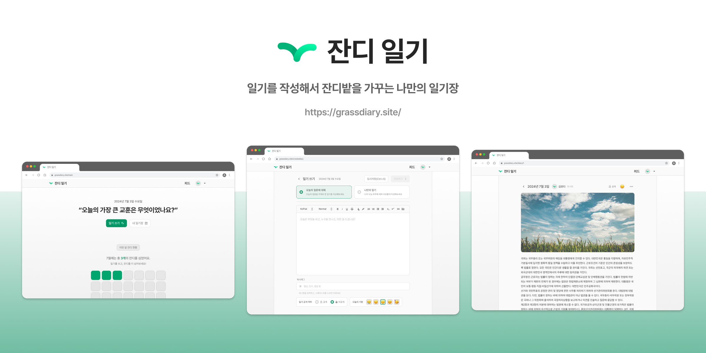
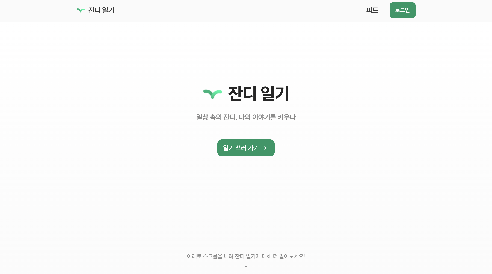
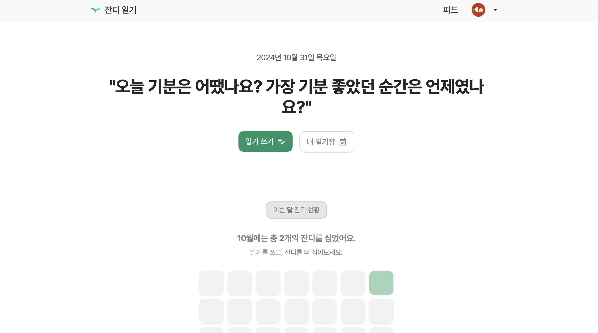
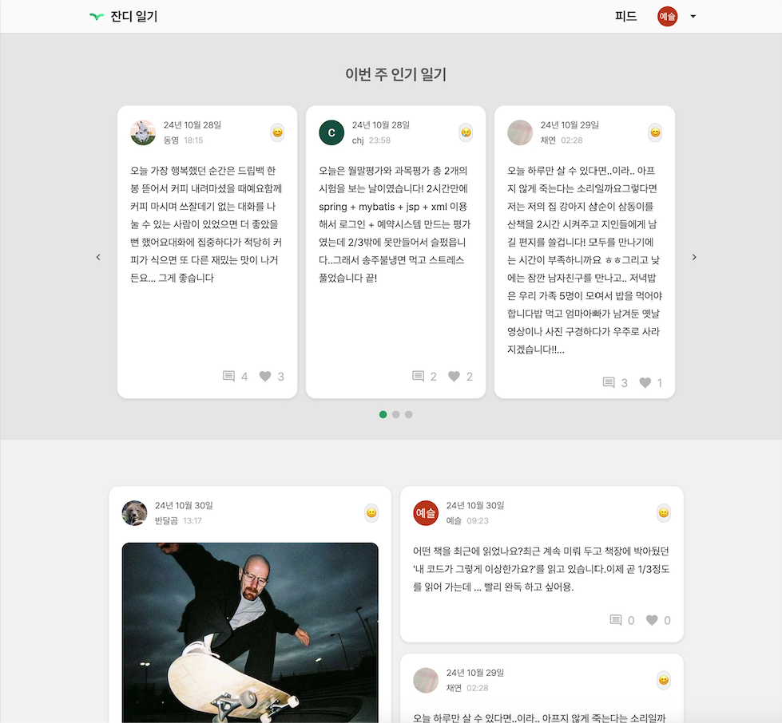
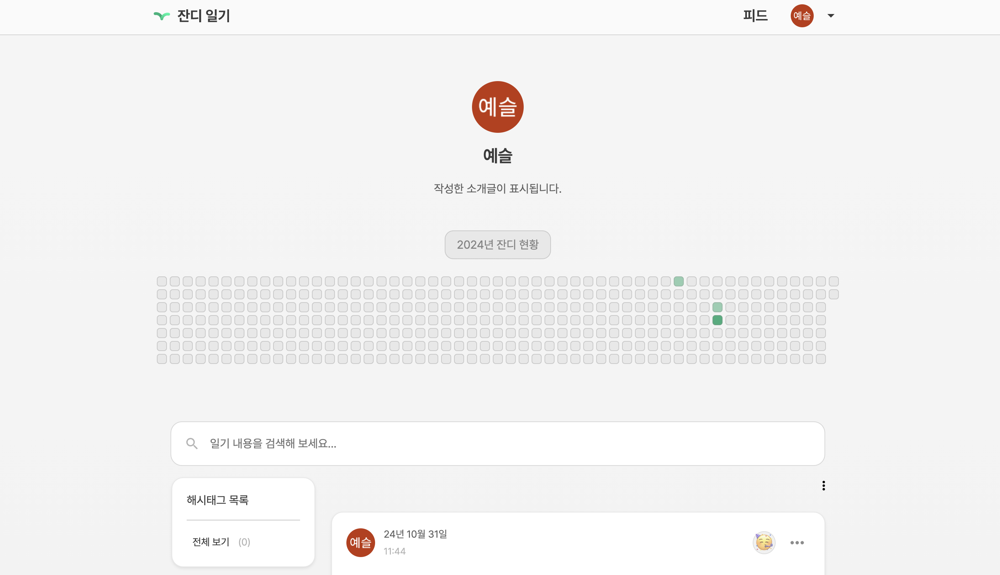
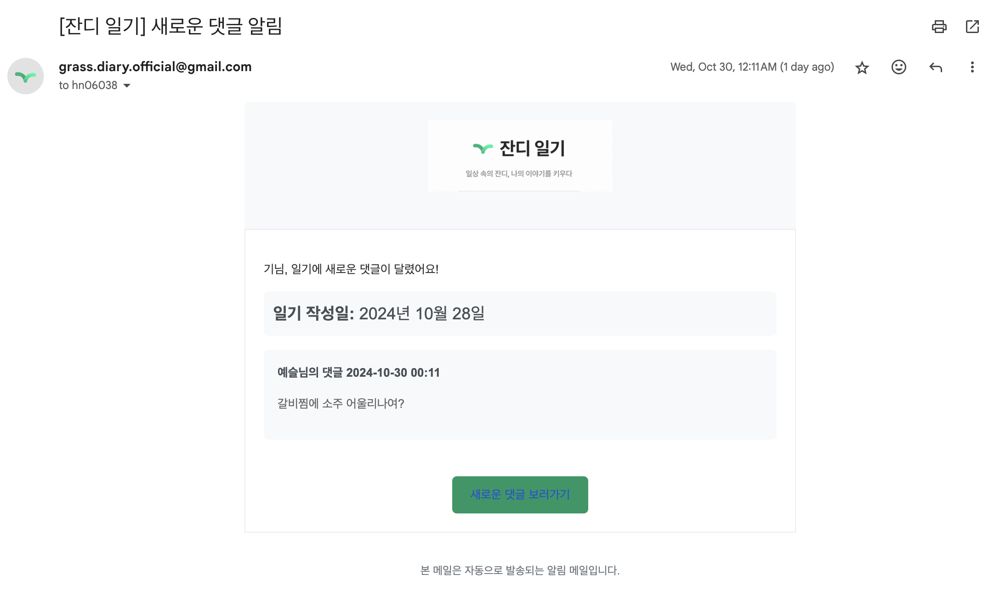
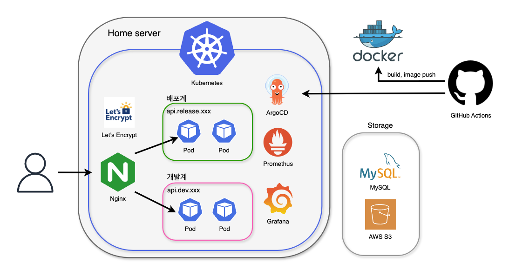
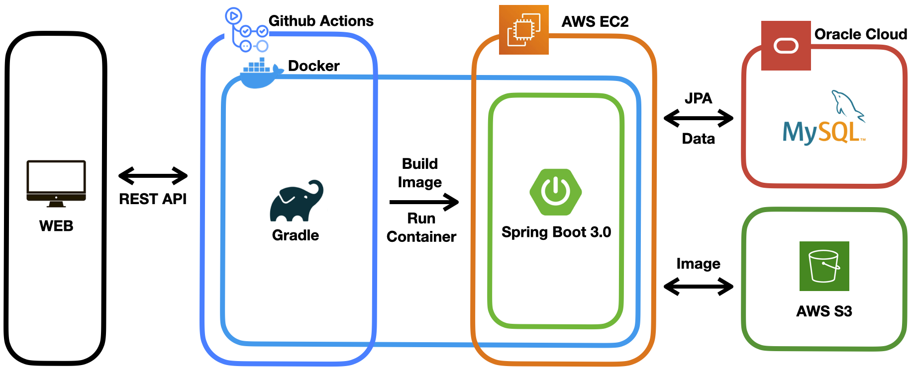

<h2>소중한 순간을 심다, 잔디 일기</h2>



<br />

##   우리 서비스는...

잔디일기는 일상의 소중한 순간들을 잔디처럼 기록하며, <br />
나의 성장을 꾸준히 지켜볼 수 있는 서비스예요. 🍀 <br />

잔디 일기 사용해 보기: [https://grassdiary.site/](https://grassdiary.site/)

<br />

##  프로젝트 주요 기능

> 개발 기간: 24.02.01 ~

- **사용자 인증 및 권한 관리**: Gmail을 이용한 로그인, OAuth2.0 기반 인증
- **일기 작성 및 관리 API**: 일기 작성, 수정, 삭제 기능 제공
- **댓글 알림 서비스**: Gmail을 통한 알림 발송
- **일기 조회 API**: 최신순/인기순으로 일기 조회 가능
- **일기 검색 API**: 해시태그와 날짜별 일기 검색 기능 제공
- **이미지 업로드**: AWS S3
- **사용자 프로필 관리**: 프로필 정보 수정 및 관리
- **포인트 기반 테마 구매**: 사용자 포인트로 테마 구매 가능
- **개발/배포 환경 분리**: 테스팅 편의를 위해 개발 환경과 배포 환경 분리


##  서비스 화면 엿보기












<br />


##  배포 환경과 서버 운영

- 배포와 개발 환경을 분리해 테스트를 더 쉽게 할 수 있도록 했어요.
- 클라우드 서비스의 유지 비용을 고려해 홈서버(온프레미스) 환경을 활용하고 있어요.
- 효율적인 서버 관리를 위해 쿠버네티스 환경을 도입했어요.



<details>
    <summary>1차 릴리즈 이후 아키텍처를 개선했어요. 토글을 열면 1차 릴리즈 당시 아키텍처를 확인할 수 있어요.</summary>
    
</details>


##  우리 팀을 소개해요!

<div align="center">
    <table>
        <th colspan="4" style="text-align: center;">Backend</th>
        <tr>
            <td></td>
            <td></td>
            <td></td>
            <td></td>
        </tr>
        <tr>
            <td><a href="https://github.com/HongYeseul">@HongYeseul</a></td>
            <td><a href="https://github.com/chjcode">@chjcode</a></td>
            <td><a href="https://github.com/minisyu">@minisyu</a></td>
            <td><a href="https://github.com/jjaegii">@jjaegii</a></td>
        </tr>
    </table>
</div>

<br />

## ✔️️ etc...

<details>
    <summary>
      Branch convention
    </summary>

| branch  | 설명                    |
|:-------:|-----------------------|
| release | 배포 되어 있는 브랜치          |
|   dev   | 다음 릴리즈 기간까지 개발 중인 브랜치 |

</details>

<details>
    <summary>
      Commit & Pull Request convention
    </summary>

```
# Commit
Type(File or function): Subject

# Pull Request
[type/worked-branch] Subject
```

|    Type    | 설명                                             |
|:----------:|------------------------------------------------|
|    feat    | 새로운 기능 추가                                      |
|    fix     | 버그 수정                                          |
|   style    | 코드 수정 없음 (세미콜론 누락, 코드 포맷팅, 파일, 폴더명 수정 혹은 이동 등) |
|  refactor  | 코드 리팩토링                                        |
|  comment   | 주석 추가 및 변경                                     |
|    docs    | 문서 수정 (README.md 등)                            |
|    test    | 테스트 코드 추가                                      |
|   chore    | 빌드 업무 수정, 패키지 매니저 수정 (pom.xml 등)               |
|   remove   | 파일 삭제                                          |

</details>
